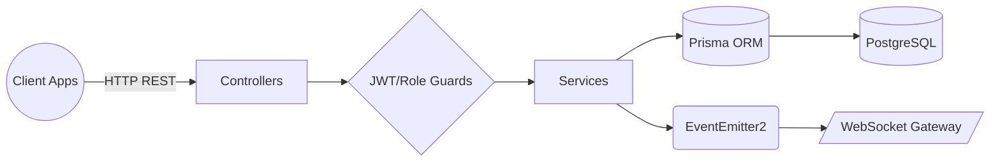
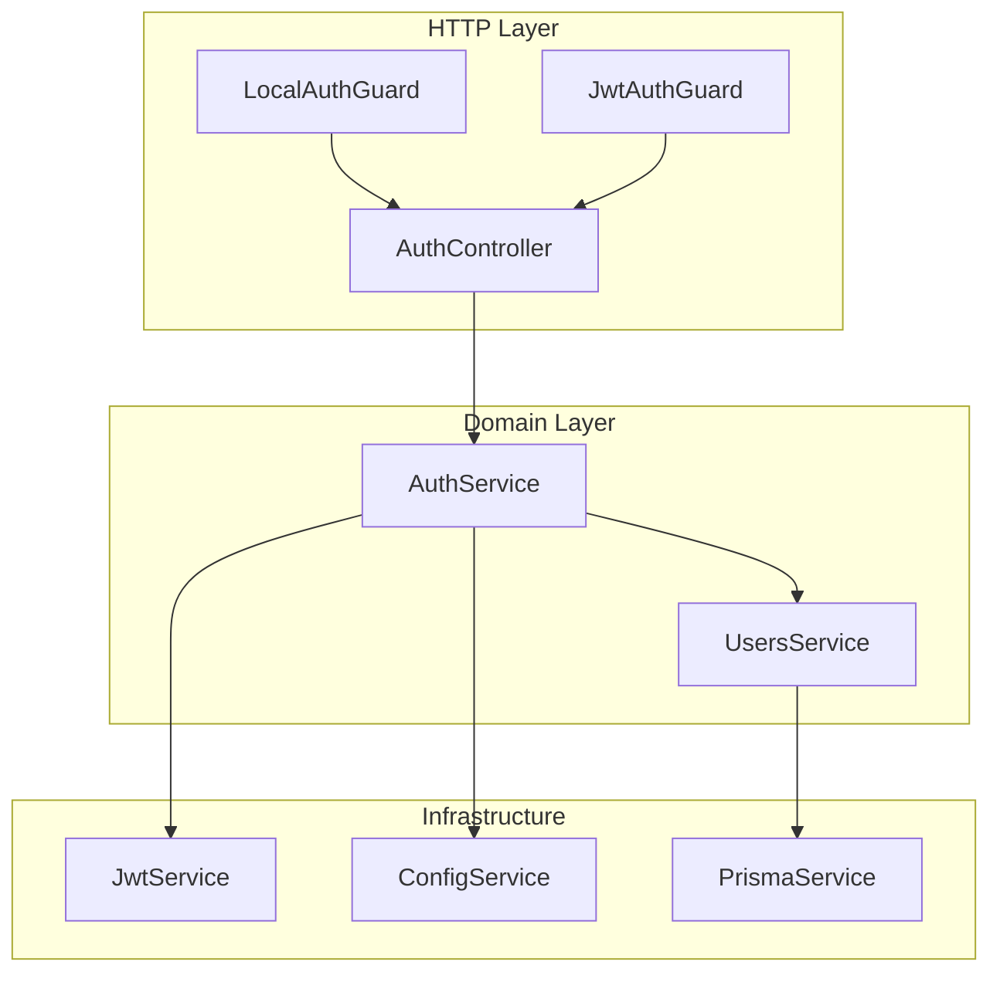
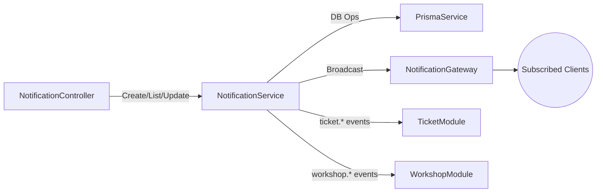
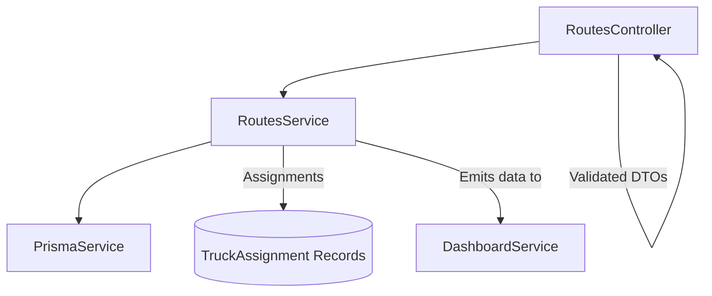
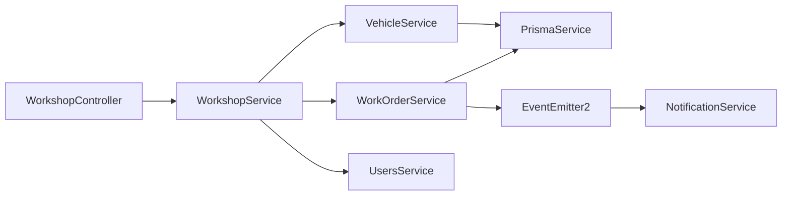
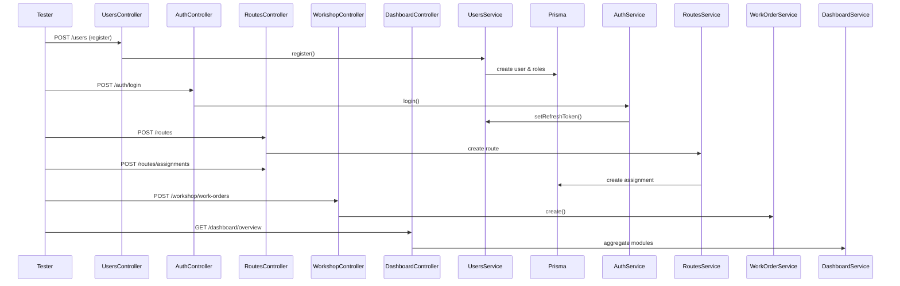

# Backend Architecture Diagrams

This README captures Mermaid diagrams that describe the main backend modules and how data flows between them. Each code block can be rendered in editors that support Mermaid (VS Code, GitHub, etc.).

## 1. High-Level Request Flow

## 2. Auth Module

## 3. Notification Module

## 4. Routes & Transport Planning

## 5. Workshop & Work Orders

## 6. Integrated Journey (Testing Perspective)

Use these diagrams as a living reference; update them when wiring or responsibilities shift so onboarding teammates can visualize the system quickly.
